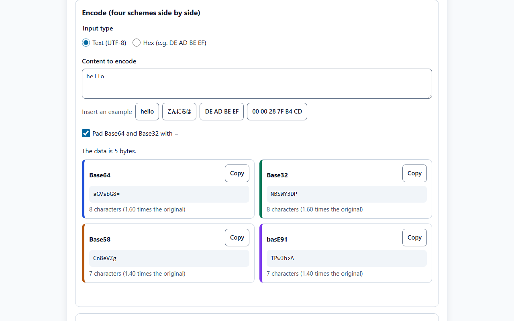
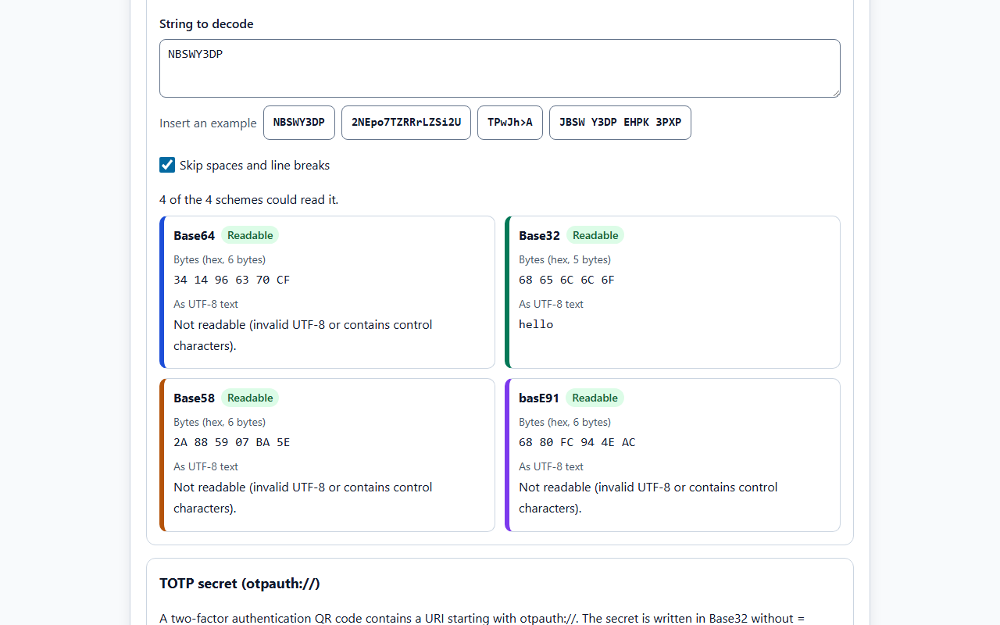
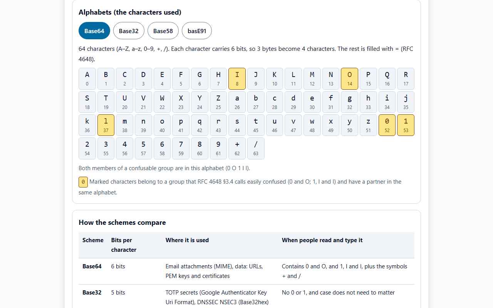
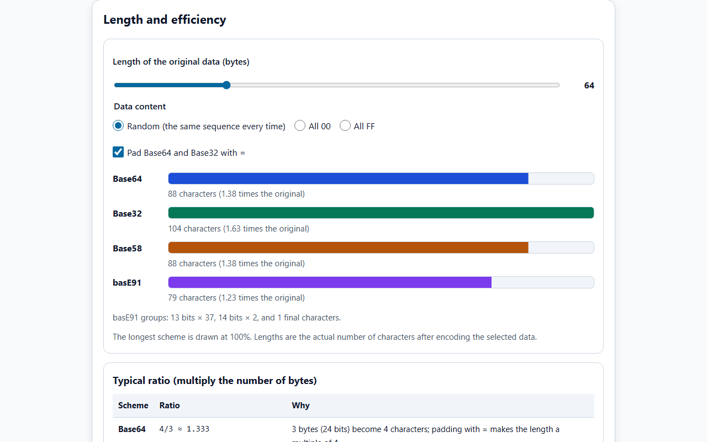
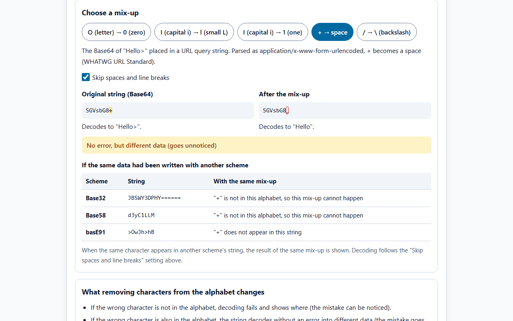
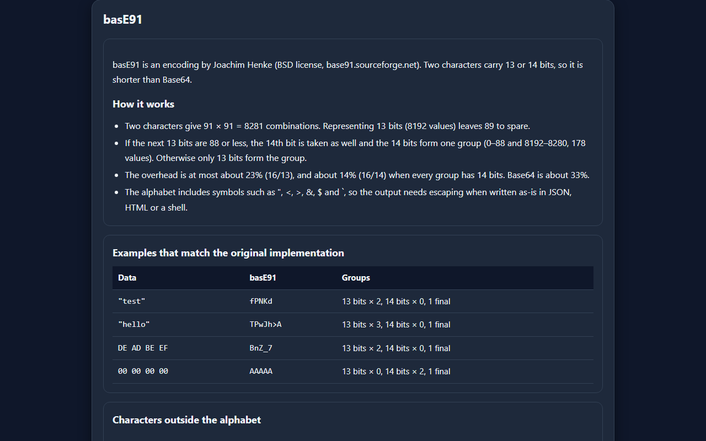
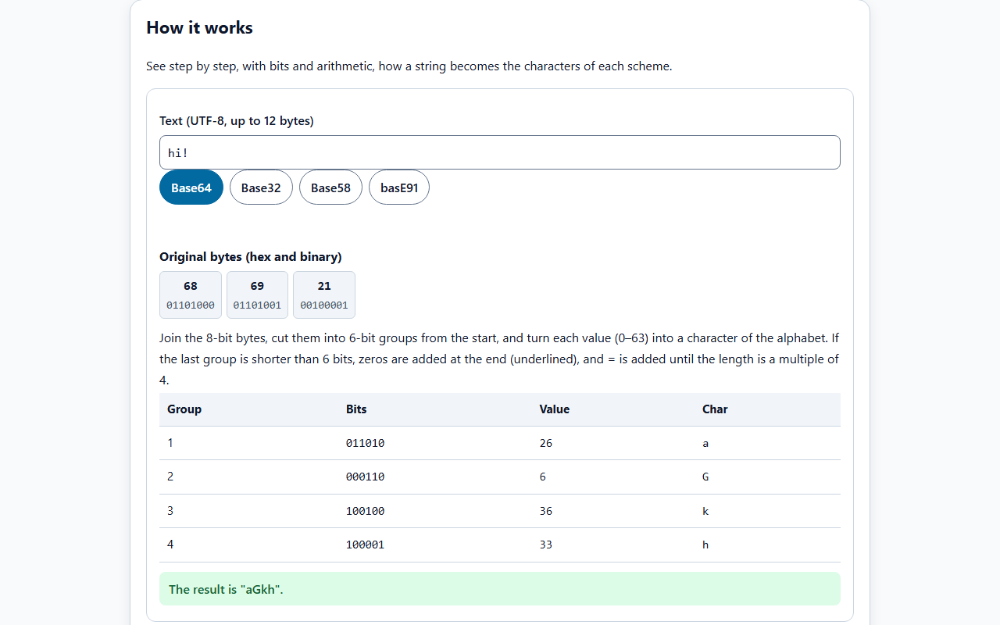
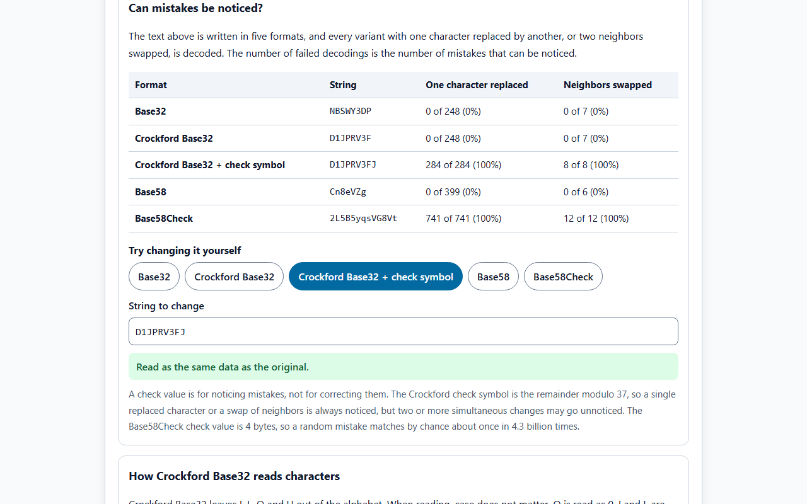

English · [日本語](README.md)

# BaseXX Visualizer - Base32/58/64/91 Encoding Comparison Tool


[](https://ipusiron.github.io/basexx-visualizer/)

**Day052 - 100 Security Tools with Generative AI**

BaseXX Visualizer is a learning tool that compares Base32, Base58 and basE91 with Base64: the characters each one uses (the alphabet), the length, and how well each holds up when people read and type the strings. It encodes with all four schemes at once, lists what each of the four schemes reads from a string, and shows what happens when look-alike characters are mixed up. It also explains the bit grouping step by step, tests whether variants and check values notice mistakes, and inspects TOTP secrets.

---

## 🌐 Demo

👉 **[https://ipusiron.github.io/basexx-visualizer/](https://ipusiron.github.io/basexx-visualizer/)**

You can try it directly in your browser.

---

## 📸 Screenshots

>
>
>*"hello" encoded with the four schemes (length and ratio to the original)*

>
>
>*"NBSWY3DP" can be read by all four schemes (Base32 gives hello)*

>
>
>*The Base64 alphabet. Characters whose confusable partner (0 and O; 1, l and I) is also present are marked*

>
>
>*Actual lengths after encoding 64 random bytes (the longest, Base32, is 100%)*

>
>
>*When + in the Base64 of "Hello>" becomes a space, a decoder that skips spaces gives "Hello" without an error*

>
>
>*How basE91 works and examples that match the original implementation (dark mode)*

>
>
>*The 24 bits of "hi!" cut into 6-bit groups and turned into Base64 characters*

>
>
>*Trying every single replacement and neighbor swap: only formats with a check value notice the mistakes*

---

## 🔑 Practical background

Most data is exchanged by copy and paste, so characters are never misread. In some situations, however, people read and type the strings themselves.

- Typing a two-factor authentication (TOTP) secret: when the QR code cannot be scanned, the Base32 secret is typed by hand
- Settings across devices: a string shown on a phone screen is typed into a computer
- Input from paper: a printed backup string is copied by hand
- Spoken communication: a string is read out over the phone

In these cases people may confuse look-alike characters such as O (letter) and 0 (zero), or I (capital i), l (lowercase L) and 1 (one). If the wrong character is also in the alphabet, the string is read as different data without an error. Base32 and Base58 reduce this problem by leaving confusable characters out of the alphabet.

---

## ✨ Features

### Basics

- Alphabet at a glance: shows each scheme's alphabet as a table of index and character, and marks characters whose confusable partner (0 and O; 1, l and I) is in the same alphabet
- How the schemes compare: a table of bits per character, where each scheme is used, and how it behaves when people read and type it

### Convert

- Encode: text (UTF-8) or hex input is encoded with Base64, Base32, Base58 and basE91 at once. Shows the number of characters and the ratio to the original, and each result can be copied. Padding Base64 and Base32 with = is optional
- Decode: a string is read with the four schemes and every scheme that can read it is listed (the bytes in hex, and the UTF-8 text when it is readable as such). For schemes that cannot read it, the kind of error and its position (which character at which position) are shown. The input is never overwritten
- Spaces and line breaks: whether decoding skips them is selectable (the number skipped is shown)
- TOTP secret: reads an otpauth:// URI or a Base32 secret and shows the issuer, account name, algorithm, digits and period, and the key bytes and length. Notes are shown against RFC 4226 (at least 128 bits required, 160 bits recommended) and RFC 6238 (key as long as the HMAC output recommended). One-time passwords are not computed

### How it works

- Shows text of up to 12 bytes step by step: 6-bit and 5-bit groups for Base64 and Base32, a table of divisions by 58 for Base58, and 13-bit and 14-bit groups split into two characters for basE91

### Length

- Choose the length (1–256 bytes) and the content (random, all 00, all FF) of the original data, and compare the actual number of characters after encoding in a bar chart. The longest scheme is drawn at 100%
- Shows the number of 13-bit and 14-bit groups in basE91, and that leading 00 bytes become "1" in Base58
- A table of typical ratios (Base64 4/3, Base32 8/5, Base58 8/log₂58, basE91 16/14 to 16/13)

### Misreading

- Choose one of five mix-ups (O→0, I→l, I→1, +→space, /→\) and see what happens when it occurs in a Base64 string. The result is one of three: "same data", "different data without an error" or "error"
- Lists whether the same mix-up can happen if the same data had been written in Base32, Base58 or basE91, and what happens if it does

### Variants and checks

- Writing in the variants: the same text in Base64, Base64url, Base32, Base32hex, Crockford Base32 (with and without a check symbol), Base58 and Base58Check, with the differences
- Can mistakes be noticed: for five formats (Base32, Crockford Base32, Crockford Base32 + check symbol, Base58, Base58Check), every single replacement and neighbor swap is tried and the failed decodings are counted
- Try changing it yourself: choose a format, edit the string, and see whether the mistake is noticed (error) or not (different data)
- How Crockford Base32 reads characters: case does not matter, O is read as 0, I and L as 1, and hyphens are ignored. The check symbol is verified too

### basE91

- Explains how it works (13 or 14 bits per 2 characters), the overhead, the symbols in its alphabet, and how characters outside the alphabet are handled
- Shows examples that match the original implementation, with the breakdown of groups

### Common

- Japanese and English (`?lang=ja`, `?lang=en`; the chosen language is saved)
- Light and dark themes (follows the OS setting unless a choice has been saved)
- Keyboard operation (tabs move with the arrow keys, Home and End)

---

## 📖 How to use

1. Type text into the upper field of the "Convert" tab to see the results of the four schemes. For hex input, select "Hex" (e.g. `DE AD BE EF`).
2. Type a string into the lower field to see what each of the four schemes reads. The string alone does not tell which scheme produced it; judge from the content of the readable results.
3. In the "Length" tab, change the length and content of the data to compare the number of characters per scheme.
4. In the "Misreading" tab, choose a mix-up and see whether it causes an error or silently gives different data. Unchecking "Skip spaces and line breaks" changes the result of +→space.
5. In the "How it works" tab, choose a scheme to see the arithmetic from the original bytes to the characters in a table.
6. In the "Variants" tab, compare how many mistakes formats with and without a check value notice. You can also edit a string yourself in the field below.
7. Enter an otpauth:// URI or a Base32 secret at the bottom of the "Convert" tab to check the key bytes and length.

---

## 🔬 Technical notes

### The four schemes

| Scheme | Alphabet | How it works |
|---|---|---|
| Base64 | A–Z, a–z, 0–9, +, / (64 characters) | 3 bytes (24 bits) become 4 characters of 6 bits each; the rest is filled with = (RFC 4648) |
| Base32 | A–Z, 2–7 (32 characters) | 5 bytes (40 bits) become 8 characters of 5 bits each; the rest is filled with = (RFC 4648) |
| Base58 | The letters and digits of Base64 without 0, O, I and l (58 characters) | The bytes are written as one number in base 58; each leading 00 byte becomes one "1" |
| basE91 | The printable ASCII characters other than space, without -, \ and ' (91 characters) | If the low 13 bits are greater than 88, 13 bits are taken, otherwise 14 bits, and written as 2 characters (91 × 91 = 8281 combinations) |

### Encoding examples

The tests recompute this table with the core module and check that it matches (`test/readme.test.js`).

| Input | Base64 | Base32 | Base58 | basE91 |
|---|---|---|---|---|
| hello | `aGVsbG8=` | `NBSWY3DP` | `Cn8eVZg` | `TPwJh>A` |
| こんにちは | `44GT44KT44Gr44Gh44Gv` | `4OAZHY4CSPRYDK7DQGQ6HANP` | `7NAasPYBzpyEe5hmwr1KL` | `cFs@CCLU=(Py\|QE@4rF` |
| DE AD BE EF (hex) | `3q2+7w==` | `32W353Y=` | `6h8cQN` | `BnZ_7` |
| 00 00 28 7F B4 CD (hex) | `AAAof7TN` | `AAACQ75UZU======` | `11233QC4` | `AAw@q#XC` |

The tests check the RFC 4648 test vectors (foobar) for Base64 and Base32, the draft-msporny-base58-03 test vectors for Base58, and, for basE91, known answers computed with a faithful port of `base91.c` from the original (base91-0.6.0).

### Length

The number of characters after actually encoding random data (the same sequence every time). Base64 and Base32 are padded with =.

| Original bytes | Base64 | Base32 | Base58 | basE91 |
|---|---|---|---|---|
| 16 | 24 | 32 | 22 | 20 |
| 32 | 44 | 56 | 44 | 40 |
| 64 | 88 | 104 | 88 | 79 |
| 256 | 344 | 416 | 350 | 315 |

For 256 bytes of 00, Base58 gives 256 characters (all "1") and basE91 gives 293 characters, because basE91 gets shorter as the number of 14-bit groups grows.

### How decoding works

- A character outside the alphabet is an error, and its position is shown. RFC 4648 requires rejecting data that contains characters outside the alphabet (unless a referring specification says otherwise), and warns that skipping them can open a covert channel or be used to avoid a comparison
- Spaces and line breaks are skipped only when selected (skipped by default)
- The trailing = of Base64 and Base32 may be omitted. If present, the count must be right. A remainder of characters that cannot form the last byte (1 character for Base64; 1, 3 or 6 characters for Base32) is an error
- Base32 also accepts lowercase (RFC 4648 says Base32 was designed so that case does not matter)
- If the leftover bits of the last character are not zero (e.g. `Zh==`), the string is read but a note is shown (another string gives the same bytes)
- The original basE91 decoder skips every character outside the alphabet, but this tool treats anything other than spaces and line breaks as an error

### Results of the misreading demo

| Mix-up | Original data | Result in Base64 |
|---|---|---|
| O→0 | A JWT header | Different data without an error |
| I→l | Sample Text | Different data without an error |
| I→1 | A JWT header | Different data without an error |
| +→space | Hello> | When spaces are skipped, "Hello" without an error; otherwise an error at character 8 |
| /→\ | Hello?World | Error at character 8 |

When a URL query string is parsed as application/x-www-form-urlencoded, + becomes a space (WHATWG URL Standard). RFC 4648 also defines a URL-safe Base64 (base64url) that uses - and _ instead of + and /.

### Variants

The results of writing "hello" (recomputed by the tests).

| Scheme | "hello" written | Difference |
|---|---|---|
| Base64 | `aGVsbG8=` | Standard |
| Base64url | `aGVsbG8` | - and _ instead of + and /, without = (RFC 4648 §5) |
| Base32 | `NBSWY3DP` | Standard |
| Base32hex | `D1IMOR3F` | 0–9 and A–V. The order of the strings matches the order of the original bytes (RFC 4648 §7) |
| Crockford Base32 | `D1JPRV3F` | Without I, L, O and U |
| Crockford Base32 + check symbol | `D1JPRV3FJ` | Adds a check symbol: the number modulo 37 |
| Base58 | `Cn8eVZg` | The Bitcoin alphabet |
| Base58Check | `2L5B5yqsVG8Vt` | Appends the first 4 bytes of a double SHA-256 before encoding |

Crockford Base32 is a notation for numbers, so when the bits are not a multiple of 5, zeros are added at the top (RFC 4648 Base32 adds them at the bottom). So the single byte "f" is `MY======` in Base32 and `36` in Crockford Base32. When reading, case does not matter, O is read as 0, I and L as 1, and hyphens are ignored.

### Error detection experiment

"hello" is written in five formats, and every string with one character replaced by another character allowed at that position, or with two different neighbors swapped, is decoded. A failed decoding counts as a noticed mistake.

| Format | String | One character replaced | Neighbors swapped |
|---|---|---|---|
| Base32 | `NBSWY3DP` | 0 of 248 | 0 of 7 |
| Crockford Base32 | `D1JPRV3F` | 0 of 248 | 0 of 7 |
| Crockford Base32 + check symbol | `D1JPRV3FJ` | 284 of 284 | 8 of 8 |
| Base58 | `Cn8eVZg` | 0 of 399 | 0 of 6 |
| Base58Check | `2L5B5yqsVG8Vt` | 741 of 741 | 12 of 12 |

Without a check, replacing a character with another one from the alphabet still decodes, so there is no error. The Crockford check symbol is the number modulo 37, and since 37 is a prime greater than 32, a single replacement or a swap of neighbors always changes the remainder. Base58Check, like Bitcoin's `EncodeBase58Check`, appends the first 4 bytes of a double SHA-256. Writing the version 00 and the public key hash `62E907B15CBF27D5425399EBF6F0FB50EBB88F18` in Base58Check gives the address of the Bitcoin genesis block, `1A1zP1eP5QGefi2DMPTfTL5SLmv7DivfNa`.

### TOTP secrets

The key `JBSWY3DPEHPK3PXP` in the Key Uri Format example is "Hello!" followed by DE AD BE EF: 10 bytes (80 bits). RFC 4226 requires keys of at least 128 bits and recommends 160 bits, so this tool warns that it is short. The other example in the same document, `HXDMVJECJJWSRB3HWIZR4IFUGFTMXBOZ`, is 20 bytes (160 bits), the length of the SHA1 output.

---

## 🎯 Use cases

- Security learning: confirm, by pasting into the decode field, that a JWT header or a Basic authentication value is merely written in Base64 and is not encryption. This version does not read the - and _ of base64url, so parts containing them cannot be read
- CTFs and puzzles: read an unknown string with the four schemes and see which ones can read it. Since several schemes may succeed, it is practice in judging by the decoded content
- Setting up two-factor authentication: when typing a secret (Base32) into an authenticator app fails, check in the decode field whether a character outside the alphabet (such as 0, 1, 8 or 9) slipped in. For handling real secrets, see "Notes and limitations"
- Development and design: when choosing the format of strings that people read out or type, such as invitation codes, order numbers or license keys, compare the length and the resistance to misreading. It gives material for choosing by purpose, for example Base64 between machines and Base32 or Base58 when people handle the string
- Classes and self-study: in an information science class, show how bits are cut into groups and turned into characters, and why the text is longer than the original data, using the bar chart and the ratio table. It works as an application of binary and base-n numbers
- Support desks and office work: for tasks where people read strings out over the phone, check in the alphabet view which characters tend to be misheard or misread
- Everyday life: know the confusable character groups for strings you print or copy by hand (such as backup strings)
- Hobbies and creative work: when making puzzles or games, use the look of Base64 (often ends with =, mixes upper and lower case) and Base32 (only capital letters and 2–7) as clues
- Research: compare the efficiency of a lesser-known scheme such as basE91 on data full of 00 and on random data
- Writing documents: show in an article or internal document that Base64 makes the text about 1.33 times longer, with a screenshot of the bar chart
- Designing numbers and codes: decide whether strings that people type, such as member numbers or coupon codes, should carry a check symbol, by looking at the error detection experiment (0% without a check, 100% with one)
- Reviewing two-factor authentication: check whether the TOTP secrets your service issues meet the 128 bits of RFC 4226 by entering the otpauth:// URI (for handling real secrets, see "Notes and limitations")
- Math classes: use the table of divisions by 58 in the "How it works" tab to practice converting numbers to base n. Reading the remainders from the bottom up is visible as is

---

## 🔒 Security

- Content Security Policy (meta tag): `default-src 'self'; script-src 'self'; style-src 'self'; img-src 'self' data:; connect-src 'none'; object-src 'none'; base-uri 'none'; form-action 'none'`. No inline scripts or styles, and no external communication
- Input is processed only in the browser and is never sent anywhere
- The page is built with the DOM (`textContent`), never `innerHTML`
- `<meta name="referrer" content="no-referrer">`; external links use `rel="noopener noreferrer"`
- Only the language and theme choices are stored in the browser (the page works even where storage is unavailable)
- No external libraries or CDNs (SHA-256 is implemented here too, and the tests compare it with Node.js `crypto`)
- TOTP secrets are also read only in the browser, and never stored or sent

---

## ⚠️ Notes and limitations

- Encoding does not keep secrets. Anyone who knows the scheme can decode any of them
- Input is limited to 4096 bytes, and decoding to 8192 characters
- "How it works" handles text of up to 12 bytes, and "Variants" up to 32 bytes
- The decode candidates in the "Convert" tab are Base64, Base32, Base58 and basE91. The variants (Base64url, Base32hex, Crockford Base32, Base58Check) are handled in the "Variants" tab
- Base58Check checks only the check value. It does not judge the kind of Bitcoin address (the leading version byte)
- The error detection experiment tries each single replacement and neighbor swap once; mistakes in two or more characters are not tried
- One-time passwords are not computed for TOTP. The tool only reads the secret and checks its length
- The results of "Misreading" follow this tool's decoding rules (the setting for skipping spaces and line breaks). Other implementations may give different results, for example by skipping characters outside the alphabet
- When entering a real secret or token, open the page on your own device and clear the fields afterwards

---

## 🧪 Tests

```bash
npm test
```

- Runs with `node --test` on Node.js 22 or later, with no dependencies (no `npm install` needed)
- Runs on GitHub Actions for every push and pull request
- `test/core.test.js`: known answers from RFC 4648, draft-msporny-base58-03 and the original basE91, round trips (0–300 bytes), kinds and positions of errors, handling of spaces, length formulas
- `test/extras.test.js`: Base64url and Base32hex (RFC 4648 §10 vectors), Crockford Base32 known answers and reading rules, SHA-256 (matches Node.js `crypto` for 0–300 bytes), Base58Check (the genesis address), error detection, the step tables, the Key Uri Format examples
- `test/readme.test.js`: recomputes the README tables (encoding examples, lengths, misreading, variants, error detection) with the core module, and checks the headings, images and directory structure of both READMEs
- `test/html.test.js`, `test/contrast.test.js`, `test/messages.test.js`, `test/i18n.test.js`, `test/format.test.js`: CSP, tab ARIA, dictionary and page text, color contrast (4.5:1 and 3:1), formatting

---

## 🔗 References

- [RFC 4648 The Base16, Base32, and Base64 Data Encodings](https://www.rfc-editor.org/rfc/rfc4648)
- [draft-msporny-base58-03 The Base58 Encoding Scheme](https://datatracker.ietf.org/doc/html/draft-msporny-base58-03)
- [Bitcoin Core src/base58.h](https://github.com/bitcoin/bitcoin/blob/master/src/base58.h) (the comment on why Base58 was chosen)
- [basE91](https://base91.sourceforge.net/) (Joachim Henke, BSD license)
- [Google Authenticator Key Uri Format](https://github.com/google/google-authenticator/wiki/Key-Uri-Format)
- [RFC 5155 DNS Security (DNSSEC) Hashed Authenticated Denial of Existence](https://www.rfc-editor.org/rfc/rfc5155) (Base32hex in NSEC3)
- [WHATWG URL Standard application/x-www-form-urlencoded](https://url.spec.whatwg.org/#application/x-www-form-urlencoded)
- [RFC 2045 MIME Part One](https://www.rfc-editor.org/rfc/rfc2045), [RFC 2397 The "data" URL scheme](https://www.rfc-editor.org/rfc/rfc2397), [RFC 7468 Textual Encodings of PKIX, PKCS, and CMS Structures](https://www.rfc-editor.org/rfc/rfc7468)
- [Douglas Crockford, Base 32](https://www.crockford.com/base32.html)
- [Bitcoin Core src/base58.cpp](https://github.com/bitcoin/bitcoin/blob/master/src/base58.cpp) (`EncodeBase58Check`)
- [RFC 4226 HOTP: An HMAC-Based One-Time Password Algorithm](https://www.rfc-editor.org/rfc/rfc4226) (R6, key length)
- [RFC 6238 TOTP: Time-Based One-Time Password Algorithm](https://www.rfc-editor.org/rfc/rfc6238) (§5.1, key length)

---

## 📁 Directory structure

```
basexx-visualizer/
├── index.html                # The page (five tabs)
├── script.js                 # Page logic (building the DOM, events)
├── style.css                 # Color tokens (light and dark) and layout
├── js/                       # Scripts shared by the page and the tests
│   ├── basexx-core.js        # Core conversions (Base64, Base32, Base58, basE91; no DOM)
│   ├── basexx-extras.js      # How it works, variants, error detection, TOTP keys (no DOM)
│   ├── messages.js           # Japanese and English text
│   ├── i18n.js               # Language selection and static text replacement
│   ├── theme-init.js         # Applies the saved theme before rendering
│   └── theme.js              # Light and dark switching
├── test/                     # Tests with node:test
│   ├── load.js               # Helper that loads js/*.js into the tests
│   ├── core.test.js          # Known answers, round trips, errors, lengths
│   ├── extras.test.js        # Variants, detection, SHA-256, how it works, TOTP keys
│   ├── readme.test.js        # README tables, headings, images, structure
│   ├── html.test.js          # CSP, ARIA, text, ids
│   ├── contrast.test.js      # Color contrast, 44px and 16px
│   ├── messages.test.js      # Dictionary keys, notation, numbers
│   ├── i18n.test.js          # How the language is chosen
│   └── format.test.js        # Line length, line endings, final newline
├── assets/                   # README screenshots
│   ├── screenshot.png        # Encode (Japanese)
│   ├── screenshot2.png       # Decode candidates (Japanese)
│   ├── screenshot3.png       # Alphabet at a glance (Japanese)
│   ├── screenshot4.png       # Length bar chart (Japanese)
│   ├── screenshot5.png       # Misreading (Japanese)
│   ├── screenshot6.png       # basE91 (Japanese, dark)
│   ├── screenshot7.png       # How it works (Japanese)
│   ├── screenshot8.png       # Can mistakes be noticed (Japanese)
│   └── en/                   # Screenshots of the English page (the same eight)
├── .github/                  # GitHub settings
│   └── workflows/            # GitHub Actions workflows
│       └── test.yml          # Runs npm test on push and pull request
├── package.json              # Defines npm test (no dependencies)
├── .gitignore                # Files kept out of Git
├── .nojekyll                 # Disables Jekyll on GitHub Pages
├── CLAUDE.md                 # Development notes for Claude Code
├── LICENSE                   # MIT License
├── README.md                 # Japanese README
└── README.en.md              # This file
```

---

## 💻 Requirements

- A recent browser (checked on Chromium, Edge and Firefox; Safari not checked)
- Works when `index.html` is opened directly (`file://`) and from a local HTTP server

```bash
python -m http.server 8000
# open http://localhost:8000/
```

---

## 📄 License

- See the `LICENSE` file (MIT) for the source code license.
- No external libraries are used. The basE91 conversion was written to follow the steps of the original (BSD license).

---

## 🛠️ About this tool

This tool was developed as part of the "100 Security Tools with Generative AI" project.
The project builds and publishes a variety of security-related tools over 100 days with the help of AI.

For details about the project and other tools, see the page below.

🔗 [https://akademeia.info/?page_id=42163](https://akademeia.info/?page_id=42163)
