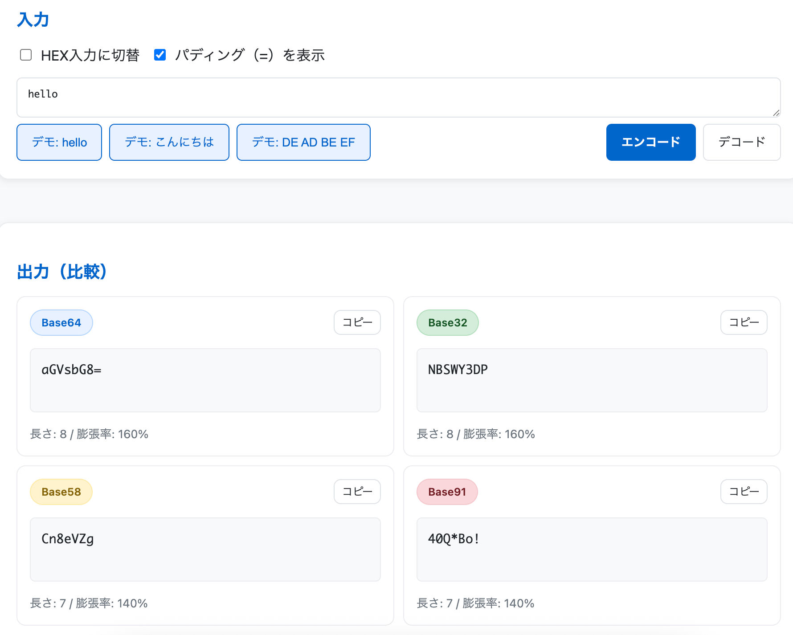

<!--
---
title: BaseXX Visualizer
category: classical-cryptography
difficulty: 2
description: Educational tool to compare Base32, Base58, Base64, and Base91 encodings with visual demos.
tags: [base32, base58, base64, base91, encoding, education, visualization]
demo: https://ipusiron.github.io/basexx-visualizer/
---
-->

# BaseXX Visualizer - Base32/58/64/91比較ツール

  
  
  
  
[](https://ipusiron.github.io/basexx-visualizer/)


**Day052 - 生成AIで作るセキュリティツール100**

**BaseXX Visualizer**は、**Base64を基準**に Base32・Base58・Base91を比較できる教育用ビジュアライザーです。  

特に、Base64の課題（誤読しやすさ）を具体例で示し、Base32/58がどのように改善しているかを体験できます。

Base91は、おまけとして雑学的に解説します。

---

## 🌐 デモページ

👉 **[https://ipusiron.github.io/basexx-visualizer/](https://ipusiron.github.io/basexx-visualizer/)**

ブラウザーで直接お試しいただけます。

---

## 📸 スクリーンショット

>   
>
> *ダミー*

---

## ⚙️ 機能仕様

### 🗂️ タブ構成

#### 1. 基本（Overview）
- 各方式の概要（文字集合・用途・特徴）を比較表で表示。  
- 文字集合をカード形式で切り替えて確認可能。  
- Base64 を基準に解説を展開。  

#### 2. 体験（Playground）
- 入力欄：テキスト（UTF-8）または HEX を選択。  
- ボタン操作で同時に Base32 / Base58 / Base64 / Base91 にエンコード。  
- 出力を 4 列で並列表示。  
- 各出力の文字数・膨張率をバッジ表示。  
- 出力ごとにコピー機能あり。  

#### 3. 長さと効率（Size/Efficiency）
- スライダーで原データ長を可変。  
- 各方式のエンコード長と膨張率をリアルタイムで計算。  
- 棒グラフで可視化し、Base64 を **100%基準** とした相対比較を表示。  

#### 4. 誤読デモ（Human Errors）
- Base64 特有の誤読例を提示：  
  - `O`（オー） ↔ `0`（ゼロ）  
  - `I`（アイ） ↔ `l`（エル） ↔ `1`（イチ）  
  - `+` ↔ スペース／URLエンコード問題  
  - `/` ↔ 区切り記号との誤解  
- 「誤読を入れる」トグルで、復号失敗やデータ化けを実演。  
- 同じ入力を Base32 / Base58 で比較し、**混同文字が集合に含まれない**ことをハイライト。  

#### 5. Base91（おまけ）
- Base91 の文字集合と特徴を簡単に解説。  
- 固定デモで Base64 より短くなる例を表示。  
- 実用上は普及していない理由も補足（特殊文字の多さ・互換性の難しさ）。  

---

### 📌 共通仕様
- **入力形式**: テキスト（UTF-8）／HEX。  
- **出力表示**: 文字列・文字数・膨張率。  
- **パディング (`=`)**: 表示オン/オフ切替可能（Base32/64のみ）。  
- **アクセシビリティ**: コピー機能に `aria-label` を付与。  
- **デモデータ**:  
  - 英語: `hello`  
  - 日本語: `こんにちは`  
  - バイナリ: `DE AD BE EF`  

---

---

## 📁 ディレクトリー構成

```
```

---

## 📄 ライセンス

MIT License - 詳細は [LICENSE](LICENSE) をご覧ください。

---

## 🛠 このツールについて

本ツールは、「生成AIで作るセキュリティツール100」プロジェクトの一環として開発されました。  
このプロジェクトでは、AIの支援を活用しながら、セキュリティに関連するさまざまなツールを100日間にわたり制作・公開していく取り組みを行っています。

プロジェクトの詳細や他のツールについては、以下のページをご覧ください。  

🔗 [https://akademeia.info/?page_id=42163](https://akademeia.info/?page_id=42163)
