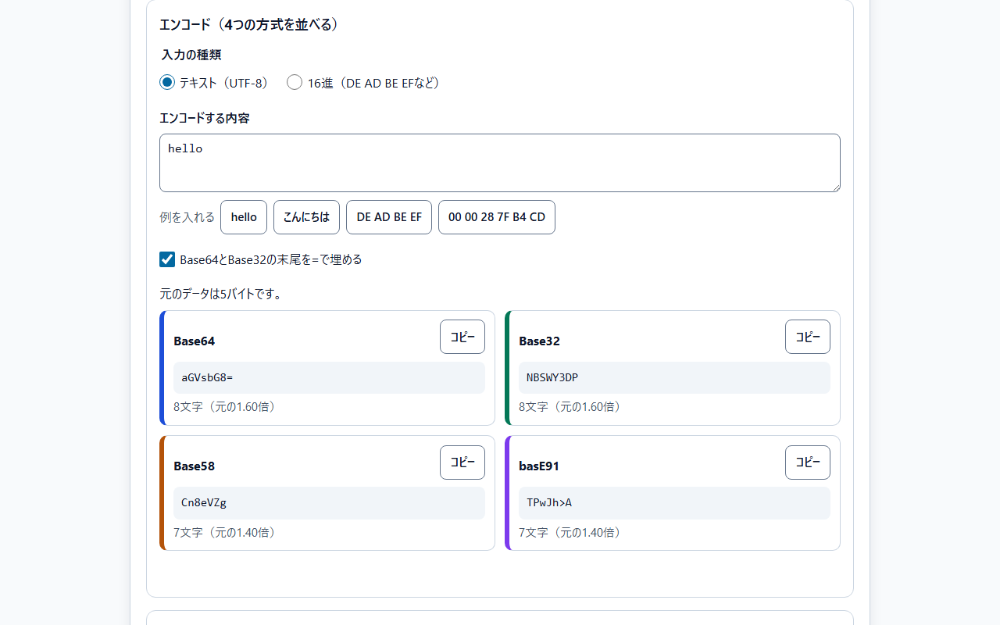
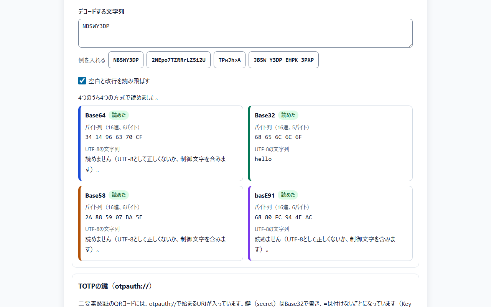
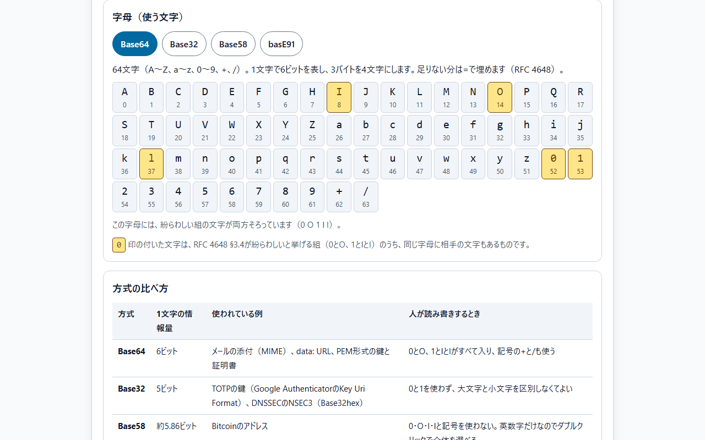
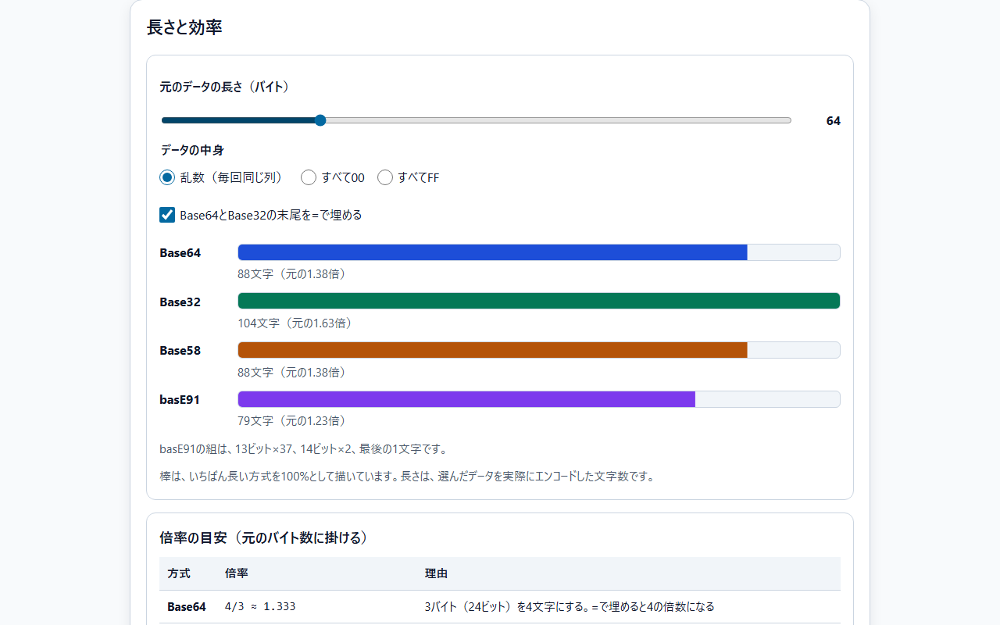
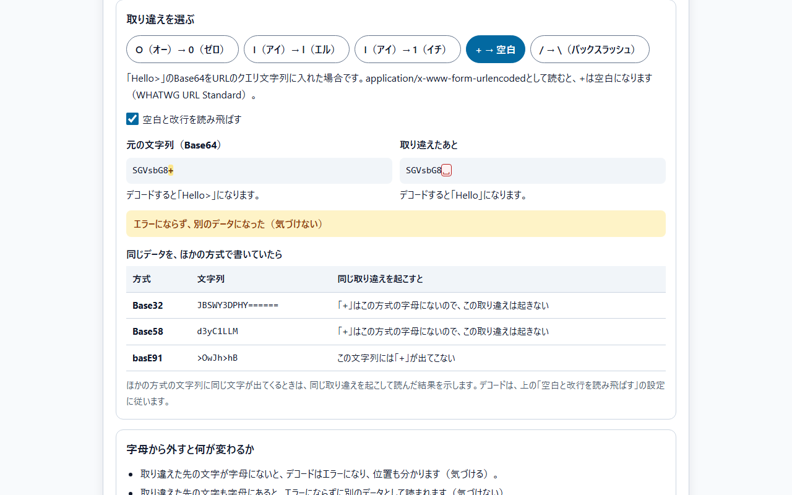
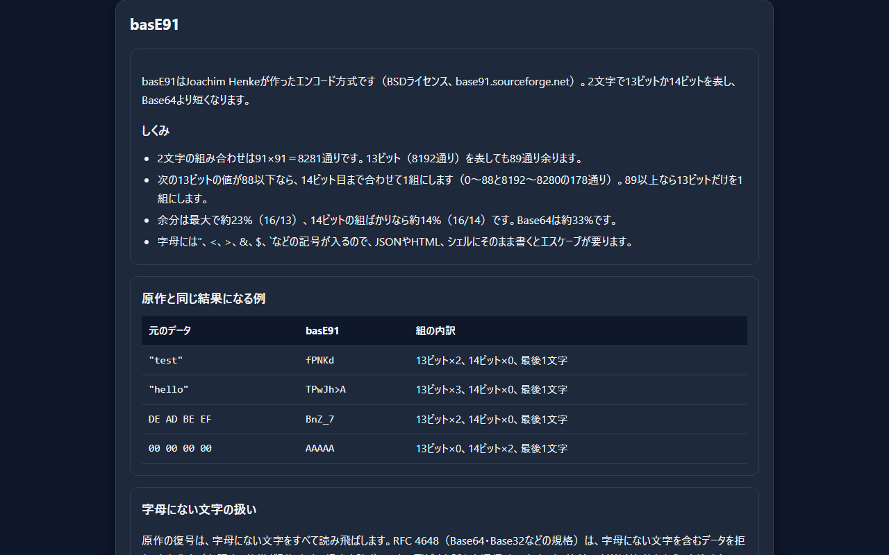

<!--
---
id: day052
slug: basexx-visualizer

title: "BaseXX Visualizer"

subtitle_ja: "Base32/58/64/91比較ツール"
subtitle_en: "Base32/58/64/91 Encoding Comparison Tool"

description_ja: "Base64を基準に、Base32・Base58・basE91の字母・長さ・読み違いへの強さを比べる学習ツール。4方式の同時エンコード、読める方式をすべて並べるデコード、実際の長さの比較、取り違えのデモを備える。"
description_en: "A learning tool that compares Base32, Base58 and basE91 with Base64: alphabets, lengths and resistance to misreading. Encodes with four schemes at once, lists every scheme that can decode a string, compares actual lengths and demonstrates character mix-ups."

category_ja:
  - エンコーディング
  - 表現変換
category_en:
  - Encoding
  - Representation Conversion

difficulty: 3

tags:
  - base32
  - base58
  - base64
  - base91
  - encoding
  - visualization
  - TOTP
  - rfc4648

repo_url: "https://github.com/ipusiron/basexx-visualizer"
demo_url: "https://ipusiron.github.io/basexx-visualizer/"

hub: true
---
-->

# BaseXX Visualizer - Base32/58/64/91比較ツール

[English](README.en.md) · 日本語


[](https://ipusiron.github.io/basexx-visualizer/)

**Day052 - 生成AIで作るセキュリティツール100**

BaseXX Visualizerは、Base64を基準に、Base32・Base58・basE91の字母（使う文字）、長さ、人が読み書きしたときの読み違いへの強さを比べる学習ツールです。4つの方式で同時にエンコードし、文字列を4つの方式で読んだ結果を並べ、形の似た文字を取り違えたときに何が起きるかを確かめられます。

---

## 🌐 デモページ

👉 **[https://ipusiron.github.io/basexx-visualizer/](https://ipusiron.github.io/basexx-visualizer/)**

ブラウザーで直接お試しいただけます。

---

## 📸 スクリーンショット

>
>
>*「hello」を4つの方式でエンコードした結果（文字数と元の何倍か）*

>
>
>*「NBSWY3DP」は4つの方式すべてで読める（Base32ならhello）*

>
>
>*Base64の字母。紛らわしい組（0とO、1とlとI）がそろう文字に印*

>
>
>*64バイトの乱数を実際にエンコードした長さ（いちばん長いBase32を100%）*

>
>
>*「Hello>」のBase64の+が空白になると、空白を読み飛ばす復号ではエラーにならず「Hello」になる*

>
>
>*basE91のしくみと、原作と同じ結果になる例（ダークモード）*

---

## 🔑 実用的な背景

ふだんのデータのやり取りはコピー＆ペーストで済むので、文字の読み違いは起きません。しかし、次のような場面では人が文字列を読み書きします。

- 二要素認証（TOTP）の鍵の手入力：QRコードを読み取れないとき、Base32の鍵を手で打ち込む
- 端末をまたぐ設定：スマートフォンの画面に出た文字列をパソコンに打ち込む
- 紙からの入力：印刷したバックアップの文字列を書き写す
- 口頭での伝達：電話などで文字列を読み上げる

このとき、O（オー）と0（ゼロ）、I（アイ）とl（エル）と1（イチ）のように形の似た文字を取り違えることがあります。取り違えた先の文字も字母に入っていると、エラーにならずに別のデータとして読まれてしまいます。Base32とBase58は、字母から紛らわしい文字を外すことで、この問題を減らしています。

---

## ✨ 機能

### 基本

- 字母の早見：4つの方式の字母を、番号と文字の表で示す。紛らわしい組（0とO、1とlとI）の相手が同じ字母にある文字に印を付ける
- 方式の比べ方：1文字の情報量、使われている例、人が読み書きするときの性質を表で比べる

### 変換

- エンコード：テキスト（UTF-8）か16進の入力を、Base64・Base32・Base58・basE91で同時にエンコードする。文字数と元の何倍かを示し、結果ごとにコピーできる。Base64とBase32の末尾を=で埋めるかを選べる
- デコード：文字列を4つの方式で読み、読めた方式をすべて並べる（バイト列の16進と、UTF-8の文字列として読めればその文字列）。読めない方式は、誤りの種類と位置（何文字目のどの文字か）を示す。入力欄は書き換えない
- 空白と改行：デコードで読み飛ばすかを選べる（読み飛ばした数を示す）

### 長さと効率

- 元のデータの長さ（1〜256バイト）と中身（乱数・すべて00・すべてFF）を選び、実際にエンコードした文字数を棒グラフで比べる。いちばん長い方式を100%として描く
- basE91の13ビットの組と14ビットの組の数、Base58で先頭の00が「1」になることを示す
- 倍率の目安（Base64は4/3、Base32は8/5、Base58は8/log₂58、basE91は16/14〜16/13）を表で示す

### 読み違い

- 5つの取り違え（O→0、I→l、I→1、+→空白、/→\）を選び、Base64の文字列に起こしたときの結果を示す。結果は「元と同じ」「エラーにならず別のデータ」「エラー」の3つに分ける
- 同じデータをBase32・Base58・basE91で書いていた場合に、同じ取り違えが起きるか、起きたらどうなるかを並べる

### basE91

- しくみ（2文字で13ビットか14ビット）、余分の割合、字母に含まれる記号の注意、字母にない文字の扱いを説明する
- 原作と同じ結果になる例を、組の内訳とともに示す

### 共通

- 日本語と英語の切り替え（`?lang=ja`・`?lang=en`、選んだ言語を保存）
- ライト・ダークの切り替え（保存した選択がなければOSの設定に従う）
- キーボード操作（タブは矢印キー・Home・Endで移動）

---

## 📖 使い方

1. 「変換」タブの上の欄にテキストを入れると、4つの方式の結果が並びます。16進で入れるときは「16進」を選びます（例：`DE AD BE EF`）。
2. 下の欄に文字列を入れると、4つの方式で読んだ結果が並びます。どの方式で作られたかは、文字列だけでは決められません。読めた結果の中身から判断します。
3. 「長さと効率」タブで、データの長さと中身を変えて、方式ごとの文字数の違いを確かめます。
4. 「読み違い」タブで取り違えを選び、エラーになるか、黙って別のデータになるかを確かめます。「空白と改行を読み飛ばす」を外すと、+→空白の結果が変わります。

---

## 🔬 技術的な説明

### 4つの方式

| 方式 | 字母 | しくみ |
|---|---|---|
| Base64 | A〜Z・a〜z・0〜9・+・/（64文字） | 3バイト（24ビット）を6ビットずつ4文字にする。足りない分は=で埋める（RFC 4648） |
| Base32 | A〜Z・2〜7（32文字） | 5バイト（40ビット）を5ビットずつ8文字にする。足りない分は=で埋める（RFC 4648） |
| Base58 | Base64の英数字から0・O・I・lを除いた58文字 | バイト列を1つの数として58進で書く。先頭の00は1バイトにつき「1」の1文字 |
| basE91 | 空白を除く印字可能なASCIIから-・\・'を除いた91文字 | 下13ビットの値が88より大きければ13ビット、88以下なら14ビットを2文字で表す（91×91＝8281通り） |

### エンコードの例

次の表は、テストが計算部で計算し直して一致を確かめています（`test/readme.test.js`）。

| 入力 | Base64 | Base32 | Base58 | basE91 |
|---|---|---|---|---|
| hello | `aGVsbG8=` | `NBSWY3DP` | `Cn8eVZg` | `TPwJh>A` |
| こんにちは | `44GT44KT44Gr44Gh44Gv` | `4OAZHY4CSPRYDK7DQGQ6HANP` | `7NAasPYBzpyEe5hmwr1KL` | `cFs@CCLU=(Py\|QE@4rF` |
| DE AD BE EF（16進） | `3q2+7w==` | `32W353Y=` | `6h8cQN` | `BnZ_7` |
| 00 00 28 7F B4 CD（16進） | `AAAof7TN` | `AAACQ75UZU======` | `11233QC4` | `AAw@q#XC` |

Base64とBase32はRFC 4648の試験値（foobar）、Base58はdraft-msporny-base58-03の試験値、basE91は原作（base91-0.6.0）の`base91.c`を忠実に移した実装で計算した既知解答を、テストで確かめています。

### 長さ

乱数のデータ（毎回同じ列）を実際にエンコードした文字数です。Base64とBase32は=で埋めた場合です。

| 元のバイト数 | Base64 | Base32 | Base58 | basE91 |
|---|---|---|---|---|
| 16 | 24 | 32 | 22 | 20 |
| 32 | 44 | 56 | 44 | 40 |
| 64 | 88 | 104 | 88 | 79 |
| 256 | 344 | 416 | 350 | 315 |

すべて00の256バイトでは、Base58は256文字（すべて「1」）、basE91は293文字になります。basE91は14ビットの組が多いほど短くなるためです。

### デコードの扱い

- 字母にない文字は、エラーにして位置を示す。RFC 4648は、字母にない文字を含むデータを拒むことを求め（参照する仕様が別に定める場合を除く）、読み飛ばすと隠れた通信路や比較のすり抜けに使われうると注意している
- 空白と改行は、選んだときだけ読み飛ばす（既定は読み飛ばす）
- Base64とBase32の末尾の=は省いてもよい。付けるなら数がそろっている必要がある。文字数の余りで最後のバイトが作れないもの（Base64は余り1文字、Base32は余り1・3・6文字）はエラーにする
- Base32は小文字も読む（RFC 4648は、Base32を大文字と小文字を区別しなくてよい形として作ったと述べている）
- 最後の文字の余りのビットが0でないもの（例：`Zh==`）は読むが、注意を示す（同じバイト列になる別の文字列がある）
- basE91の原作の復号は字母にない文字をすべて読み飛ばすが、このツールは空白と改行以外をエラーにする

### 読み違いのデモの結果

| 取り違え | 元のデータ | Base64での結果 |
|---|---|---|
| O→0 | JWTのヘッダー | エラーにならず、別のデータになる |
| I→l | Sample Text | エラーにならず、別のデータになる |
| I→1 | JWTのヘッダー | エラーにならず、別のデータになる |
| +→空白 | Hello> | 空白を読み飛ばすとエラーにならず「Hello」になる。読み飛ばさなければ8文字目でエラー |
| /→\ | Hello?World | 8文字目でエラー |

URLのクエリ文字列をapplication/x-www-form-urlencodedとして読むと、+は空白になります（WHATWG URL Standard）。RFC 4648には、+と/を-と_に替えたURL用のBase64（base64url）があります。

---

## 🎯 ユースケース

- セキュリティの学習：JWTのヘッダーやBasic認証の値がBase64で書かれているだけで、暗号ではないことを、デコード欄に入れて確かめる。現版はbase64urlの-と_を読まないので、それを含む部分は読めない
- CTF・謎解き：正体の分からない文字列を4つの方式で読み、どれで読めるかを並べて見る。複数の方式で読めることもあるので、読めた中身で判断する練習になる
- 二要素認証の設定：認証アプリへの鍵（Base32）の手入力に失敗したとき、デコード欄で、字母にない文字（0・1・8・9など）が混じっていないかを確かめる。本物の鍵の扱いは「注意と限界」を参照
- 開発・設計：招待コード、注文番号、ライセンスキーなど、人が読み上げたり打ち込んだりする文字列の形式を選ぶとき、長さと読み違いへの強さを比べる。機械どうしならBase64、人が扱うならBase32やBase58というように、目的で選ぶ材料になる
- 授業・自習：情報の授業で「ビットを区切って文字にする」しくみと、文字数が元のデータより増える理由を、長さの棒グラフと倍率の表で示す。2進数やn進数の単元の応用として使える
- サポート窓口・事務：電話で文字列を読み上げてもらう業務で、どの文字が聞き間違い・読み間違いを生みやすいかを、字母の早見で確かめる
- 暮らし：紙に印刷したり手で書き写したりする文字列（バックアップの文字列など）で、紛らわしい文字の組を知っておく
- 趣味・創作：謎解きやゲームの問題作りで、Base64（=で終わることが多い、大文字と小文字が混じる）とBase32（大文字と2〜7だけ）の見た目の違いを手がかりに使う
- 研究・調べもの：basE91のように知名度の低い方式の効率を、00ばかりのデータと乱数のデータで比べる
- 資料づくり：技術記事や社内資料で、Base64の文字数が約1.33倍になることを、棒グラフのスクリーンショットで示す

---

## 🔒 セキュリティ

- Content Security Policy（metaタグ）：`default-src 'self'; script-src 'self'; style-src 'self'; img-src 'self' data:; connect-src 'none'; object-src 'none'; base-uri 'none'; form-action 'none'`。インラインのスクリプト・スタイルを許さず、外部への通信もしない
- 入力はブラウザーの中だけで処理し、どこにも送らない
- 画面の組み立てはDOM（`textContent`）で行い、`innerHTML`を使わない
- `<meta name="referrer" content="no-referrer">`、外部リンクは`rel="noopener noreferrer"`
- ブラウザーに保存するのは、言語とテーマの選択だけ（保存できない環境でも動く）
- 外部のライブラリーやCDNを使わない

---

## ⚠️ 注意と限界

- エンコードは秘密を守らない。どの方式も、方式が分かれば誰でもデコードできる
- 入力は4096バイトまで、デコードは8192文字までに限っている
- base64url・Base32hex・Crockford Base32は読まない。Base58Check（Bitcoinのアドレスの検査用の値）は計算しないので、アドレスの正しさは確かめられない
- 「読み違い」の結果は、このツールの復号の扱い（空白と改行の読み飛ばしの設定）での結果である。ほかの実装では、字母にない文字を読み飛ばすなど、結果が変わることがある
- 本物の鍵やトークンを入れるときは、自分の端末で開き、使い終わったら入力欄を消す

---

## 🧪 テスト

```bash
npm test
```

- Node.js 22以上の`node --test`で動き、依存パッケージはない（`npm install`は不要）
- GitHub Actionsで、pushとpull requestのたびに実行する
- `test/core.test.js`：RFC 4648・draft-msporny-base58-03・原作basE91の既知解答、往復（0〜300バイト）、誤りの種類と位置、空白の扱い、長さの式
- `test/readme.test.js`：READMEの表（エンコードの例・長さ・読み違い）を計算部で計算し直し、日英のREADMEの見出し・画像・ディレクトリー構造を確かめる
- `test/html.test.js`・`test/contrast.test.js`・`test/messages.test.js`・`test/i18n.test.js`・`test/format.test.js`：CSP、タブのARIA、辞書と画面の文言、配色のコントラスト（4.5:1・3:1）、書式

---

## 🔗 参考

- [RFC 4648 The Base16, Base32, and Base64 Data Encodings](https://www.rfc-editor.org/rfc/rfc4648)
- [draft-msporny-base58-03 The Base58 Encoding Scheme](https://datatracker.ietf.org/doc/html/draft-msporny-base58-03)
- [Bitcoin Core src/base58.h](https://github.com/bitcoin/bitcoin/blob/master/src/base58.h)（Base58を選んだ理由のコメント）
- [basE91](https://base91.sourceforge.net/)（Joachim Henke、BSDライセンス）
- [Google Authenticator Key Uri Format](https://github.com/google/google-authenticator/wiki/Key-Uri-Format)
- [RFC 5155 DNS Security (DNSSEC) Hashed Authenticated Denial of Existence](https://www.rfc-editor.org/rfc/rfc5155)（NSEC3のBase32hex）
- [WHATWG URL Standard application/x-www-form-urlencoded](https://url.spec.whatwg.org/#application/x-www-form-urlencoded)
- [RFC 2045 MIME Part One](https://www.rfc-editor.org/rfc/rfc2045)・[RFC 2397 The "data" URL scheme](https://www.rfc-editor.org/rfc/rfc2397)・[RFC 7468 Textual Encodings of PKIX, PKCS, and CMS Structures](https://www.rfc-editor.org/rfc/rfc7468)

---

## 📁 ディレクトリー構造

```
basexx-visualizer/
├── index.html                # 画面（5つのタブ）
├── script.js                 # 画面の処理（DOMの組み立て・イベント）
├── style.css                 # 配色トークン（ライト・ダーク）とレイアウト
├── js/                       # 画面と同じスクリプト（テストからも読む）
│   ├── basexx-core.js        # 変換の計算部（Base64・Base32・Base58・basE91、DOMなし）
│   ├── messages.js           # 日本語と英語の文言
│   ├── i18n.js               # 言語の選択と静的な文言の差し替え
│   ├── theme-init.js         # 描画前に保存したテーマを当てる
│   └── theme.js              # ライト・ダークの切り替え
├── test/                     # node:testのテスト
│   ├── load.js               # js/*.jsをテストに読み込む補助
│   ├── core.test.js          # 既知解答・往復・誤り・長さ
│   ├── readme.test.js        # READMEの表・見出し・画像・構造
│   ├── html.test.js          # CSP・ARIA・文言・id
│   ├── contrast.test.js      # 配色のコントラストと44px・16px
│   ├── messages.test.js      # 辞書のキー・表記・数値
│   ├── i18n.test.js          # 言語の決め方
│   └── format.test.js        # 行の長さ・改行・末尾
├── assets/                   # READMEのスクリーンショット
│   ├── screenshot.png        # エンコード（日本語）
│   ├── screenshot2.png       # デコードの候補（日本語）
│   ├── screenshot3.png       # 字母の早見（日本語）
│   ├── screenshot4.png       # 長さの棒グラフ（日本語）
│   ├── screenshot5.png       # 読み違い（日本語）
│   ├── screenshot6.png       # basE91（日本語・ダーク）
│   └── en/                   # 英語の画面のスクリーンショット（同じ6枚）
├── .github/                  # GitHubの設定
│   └── workflows/            # GitHub Actionsのワークフロー
│       └── test.yml          # pushとpull requestでnpm testを実行
├── package.json              # npm testの定義（依存なし）
├── .gitignore                # Gitに含めないファイル
├── .nojekyll                 # GitHub PagesでJekyllを使わない
├── CLAUDE.md                 # Claude Code向けの開発メモ
├── LICENSE                   # MITライセンス
├── README.md                 # このファイル
└── README.en.md              # 英語版のREADME
```

---

## 💻 動作環境

- 最近のブラウザー（Chromium・Edge・Firefoxで動作を確かめている。Safariは未確認）
- `index.html`を直接開いても（`file://`）、ローカルのHTTPサーバーでも動く

```bash
python -m http.server 8000
# http://localhost:8000/ を開く
```

---

## 📄 ライセンス

- ソースコードのライセンスは`LICENSE`ファイル（MIT）を参照してください。
- 外部のライブラリーは使っていません。basE91の変換は、原作（BSDライセンス）の手順に合わせて書いたものです。

---

## 🛠️ このツールについて

本ツールは、「生成AIで作るセキュリティツール100」プロジェクトの一環として開発されました。
このプロジェクトでは、AIの支援を活用しながら、セキュリティに関連するさまざまなツールを100日間にわたり制作・公開していく取り組みを行っています。

プロジェクトの詳細や他のツールについては、以下のページをご覧ください。

🔗 [https://akademeia.info/?page_id=42163](https://akademeia.info/?page_id=42163)
